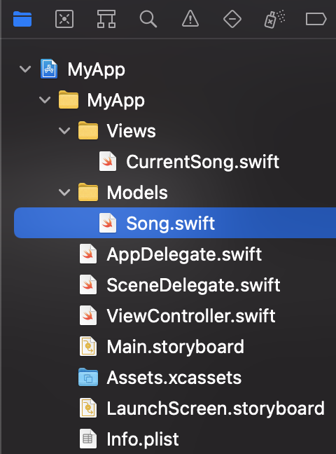

`Desarrollo Mobile` > `Swift Intermedio 2`

## PostWork de la Sesión 1

### OBJETIVO

- Crear una struct con variables de tipo optional
- Implementar observers y funciones de alto nivel

**Antes de empezar**

**⚙️ Setup**

- Asegurarnos de tener XCode instalado (la versión 12.5.1 es suficiente).
- Tener clonado (de preferencia para su revisión) o en un zip el proyecto que hemos estado utilizando hasta el módulo anterior.

**Indicaciones generales**

Con base en la aplicación que has ido desarrollando a lo largo del curso, crearás archivos nuevos para validar lo que has aprendido:

- Modificar la struct con variables tipo optional, pensemos  que vamos a llenar esta estructura  utilizando datos  que vendrán del backend y que es posible o no, que contengan algún valor.
- Definir un property observer, para poder monitorear cuando el tiempo transcurrido de la canción sea actualizado.
- Crear otra class para procesar los datos que obtendremos del servicio y posteriormente proceder a filtrarlos utilizando HOF (higher order functions).

#### DESARROLLO

1. Abre el proyecto del módulo
2. Elige nuestro archivo “Modelos.swift”. En él vamos a modificar la struct Track:
   - Agrega el protocolo Codable, nos será útil para mapear los datos que se obtenga posteriormente en formato JSON

   - Además agregaremos/modificaremos algunos parámetros para que sean tipo optional (los que terminan en ?). Al final tu código debe quedar así:

     

3. Observaras que esta nueva definición causa un error con la variable tipo  arreglo de tracks que teníamos declarado anteriormente. ¿Puedes determinar cómo arreglar el error?
4. En nuestra clase AudioPlayerViewController:
    - necesitamos que el slider de “posición” se actualice conforme se reproduce el sonido, así que analiza el código de la clase AudioPlayer (la que agregamos con el paquete externo) para;
    - determinar si es posible obtener el tiempo de reproducción del sonido, y 
    - si esta propiedad podría ser observada utilizando alguna de las técnicas vistas en la sesión.

5. Crea una nueva clase y nómbrala DataManager, esta clase nos servirá para administrar el arreglo de canciones que se mostrarán en la aplicación en las distintas vistas. En esta clase:
    - Declara un método estático, que se llamará cancionesPorGenero. 
    - Este método debe recibir el arreglo de structs (que corregiste en el paso 3) y regresar un nuevo arreglo que solo contenga aquellas canciones donde está definida la property genre (filtra el arreglo usando HOF).

