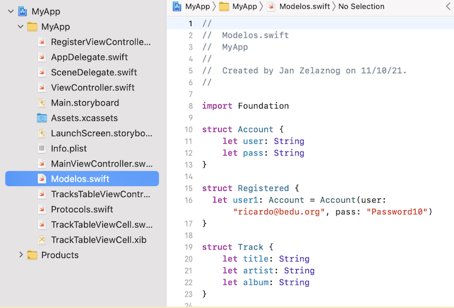

`Desarrollo Mobile` > `Swift Intermedio 2`

## Esqueleto de la App

### OBJETIVO

- Crear la App que servirá de partida para el proyecto final.

#### REQUISITOS

1. Xcode 11
2. Ejemplo-01 terminado

#### DESARROLLO

Completar el Layout.  

**Requisitos:**

1.- Crear un TableView con custom cells.

2.- Agregar constraints para replicar los tamaños en la vista.

3.- Asignar iconos.

4.- Al seleccionar una celda ir a la vista de reproducción.

NOTA: Cuidar el uso de Optionals.
Property Observers podrían omitirse de momento, pero si se quieren implementar, utilizarlos en el progressbar y labels de tiempo de progreso la canción.

Interfaz sugerida:

