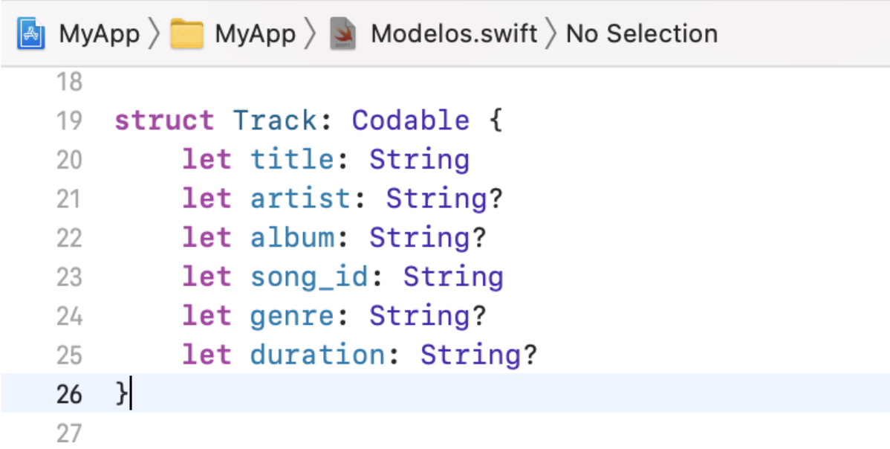

`Desarrollo Mobile` > `Swift Intermedio 2`

### OBJETIVO

- Comenzar a implementar nueva funcionalidad y mejorar la estructura de nuestra app de música, al llegar a la sesión 8, tendremos un proyecto final.

#### REQUISITOS

1. Xcode 12+

#### DESARROLLO

Hacer las implementaciones que se propusieron en el _Work_.  

**Requisitos:**

1.- Crear una _class_ nueva, llamada _Song_ que incluya algunos **_Optionals_**.
- Utilizar el [Reto 01](Reto-01).

2.- Crear un **_Property Observer_** que por ahora imprima el _oldValue_ implementando el metodo _didSet_.
- Utilizar el [Reto 02](Reto-02).

3.- Jugar con **_Higher Order Functions_**.
- Utilizar el [Reto 03](Reto-03).
- Leer el material que se utilizo en el **_Prework_**

4.- Al seleccionar una celda ir a la vista de reproducción.

NOTA: Cuidar el uso de Optionals.
Property Observers podrían omitirse de momento, pero si se quieren implementar, utilizarlos en el progressbar y labels de tiempo de progreso la canción.

Estructura final:

