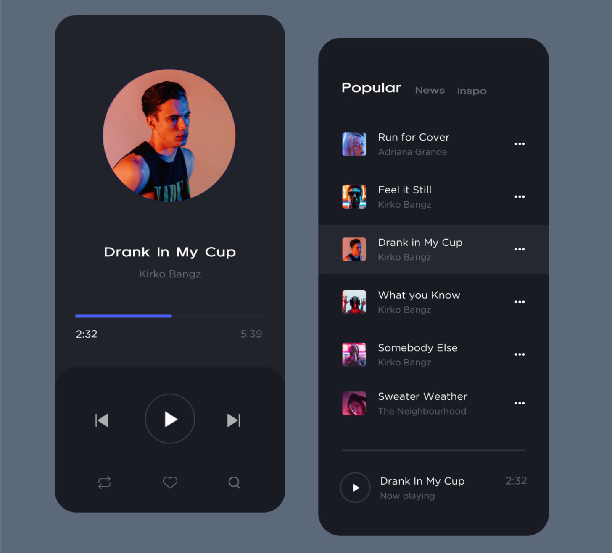

`Desarrollo Mobile` > `Swift Intermedio 2`

## App inicial para proyecto final

### OBJETIVO 

- Crear una maqueta de App para comenzar el desarrollo del proyecto final.

#### REQUISITOS 

1. Xcode 11

#### DESARROLLO

1.- Crear un nuevo proyecto con Swift y Storyboard.

2.- Implementar una App que tenga dos vistas similares a la mostrada en la imágen.

3.- Los [iconos](icons) estan en el repositorio.

> Fuente: https://dribbble.com/shots/7945280-Music-Player

        
Solución

        
 Una vez creado el proyecto ir al Storyboard.

        
 Agregar dos ViewControllers

        
 Al primer ViewController agregarle un TableView con celdas customizadas.

        
 Al segundo ViewController agregarle los elementos de UIImageView, UILabels, UIButtons para la reproducción de video y un ProgressBar.

        
 Al seleccionar una celda ir a la vista de reproducción de musica.

