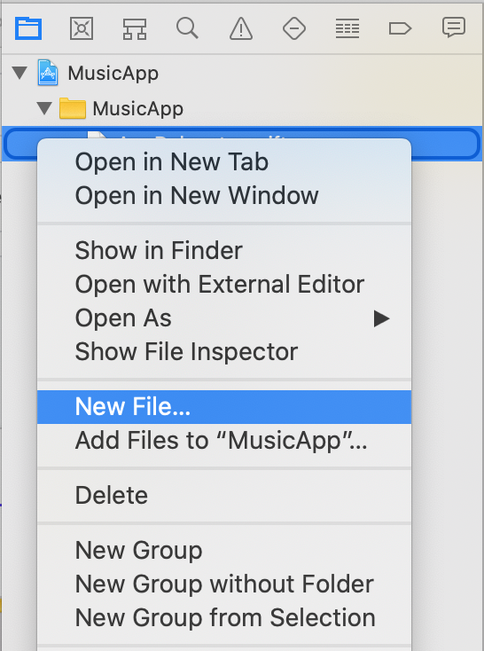
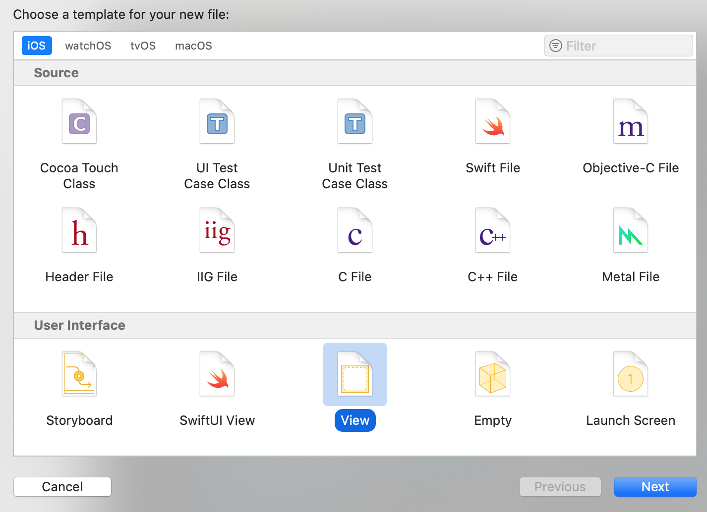
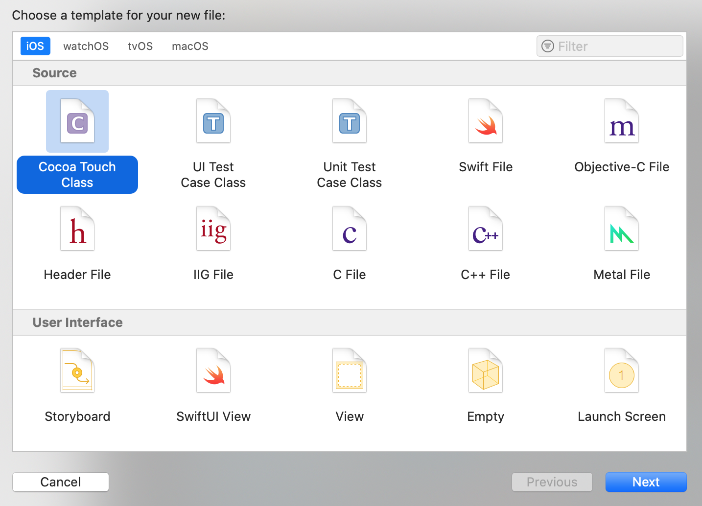
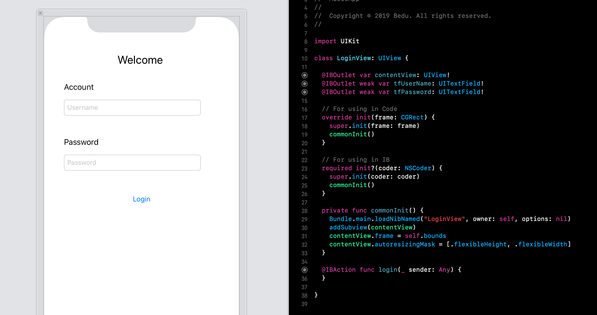

`Desarrollo Mobile` > `Swift Intermedio 2`

## Login View XIB

### OBJETIVO

- Implementar una vista mediante **XIBs**.

#### REQUISITOS

1. Xcode 11

#### DESARROLLO

Con base en el proyecto creado en la **Sesión-01**, crear una vista de login basándose en **XIBs**.

> No agregar constraints.

1.- En el navigator pane, dar click derecho y seleccionar `New File...`. Nombre sugerido para los archivos: `LoginView`.

2.- De esa manera agregaremos dos archivos, uno de View correspondiente al XIB y uno de clase que será el encargado de interactuar con la vista.

3.- En el **XIB** agregado implementar el sig. layout.

Por supuesto, el `File's Owner` del **XIB** deberá ser de la clase que creamos.

