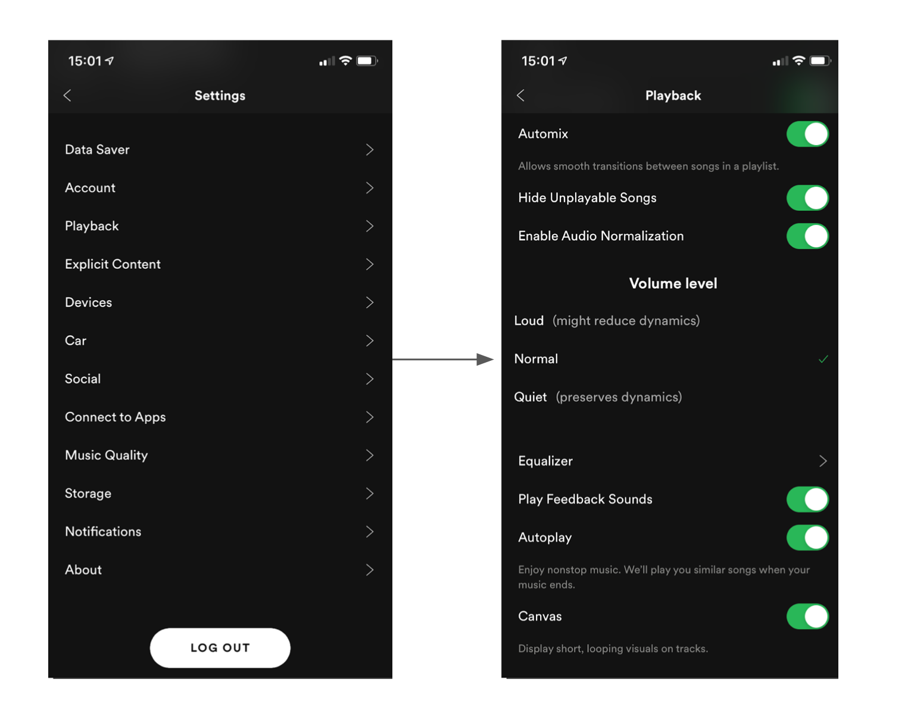
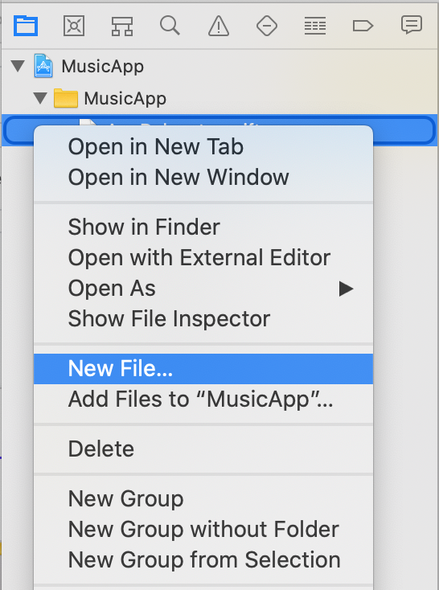
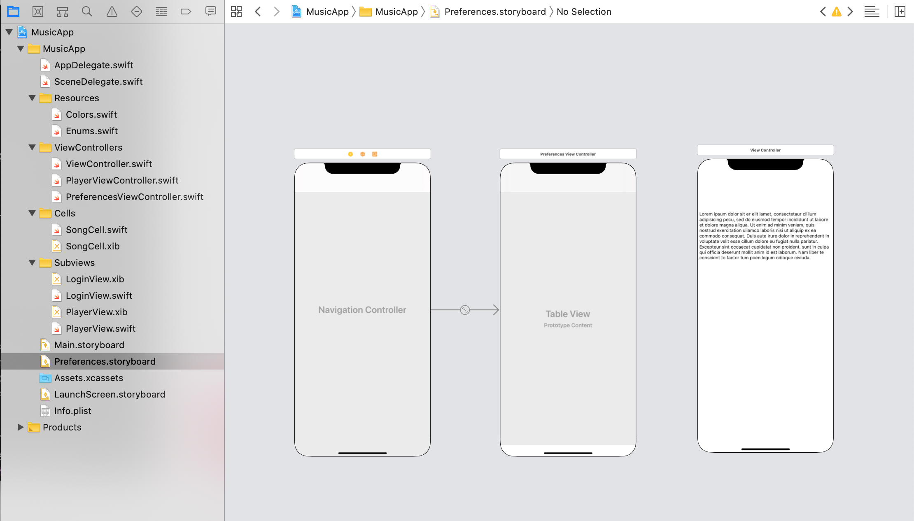

`Desarrollo Mobile` > `Swift Intermedio 2`

## Agregando un nuevo Storyboard

### OBJETIVO

- A agregar nuevos flujos en la app utilizando diferentes storyboards.

#### REQUISITOS

1. Xcode 11.

#### DESARROLLO

Agregaremos un nuevo Storyboard, este contendrá vistas nuevas.

El flujo a desarrollar es de Preferencias de la App.

Las opciones pueden ser como las que se muestran.

1.- Damos clik derecho sobre los archivos del navigation y agregamos un nuevo archivo de Storyboard...

2.- Una vez agregado el archivo, creamos el flujo:

3.- Podemos agregar los Archivos de clase de cada vista.