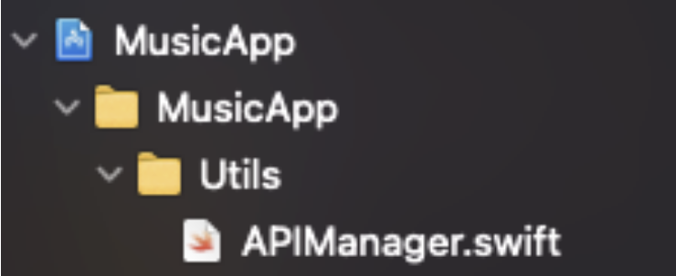
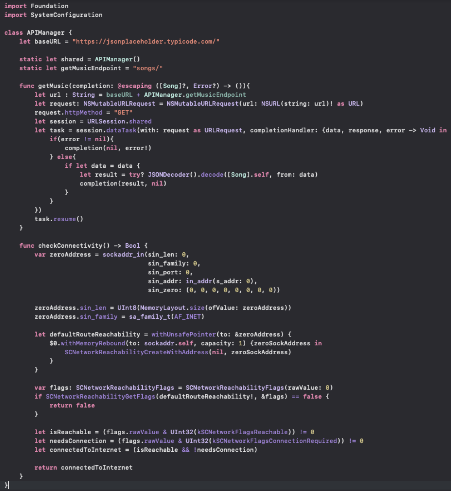

`Desarrollo Mobile` > `Swift Intermedio 2`
## Postwork de la Sesión 02

**Objetivo** 
- Integrar un método para determinar si hay conexión a internet.
- Reutilizar la clase para hacer llamadas tipo REST utilizando URLSession, que se creó durante la sesión.

**Antes de empezar**
**⚙️ Setup**
- XCode 12+.
- Aplicación de música con la que has estado trabajando.

**Desarrollo**
- En tú app de música, lleva a cabo la implementación de los requerimientos para conexión a Internet que pudiste ver en los retos de esta sesión: 
    - Agrega el framework SystemConfiguration
    - Configuración de AppTransportSecuritySettings para permitir conexión a cualquier dominio.

- Crear el grupo: Utils:

- Dentro de Utils crea el APIManager:

- El APIManager, deberá de quedar de la siguiente manera:

- Asegúrate de tener compilado la app para el final de esta sesión.

**¡Recapitulemos!**

- Tu proyecto deberá de compilar sin problemas una vez que hayas creado el APIManager.

