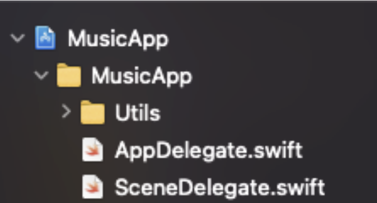

`Desarrollo Mobile` > `Swift Intermedio 2`

## Conectando dos Storyboards

### OBJETIVO

- Utilizar las vistas creadas en el Storyboard de Preferencias.

#### REQUISITOS

1. Proyecto con Storyboard de preferencias con el flujo creado.
2. Xcode 11.

#### DESARROLLO

1.- En el proyecto debemos tener el **Storyboard** de `Preferences`.

2.- En el **Storyboard** principal `Main`. Cambiaremos el flujo a Navigation.



3.- Lo mismo con el flujo de `Preferences.storyboard`.

4.- En la vista principal, agregar un botón en la barra de navegación que te lleve al flujo de Preferencias.

Pistas:

```
let storyboard = AppStoryboard.Preferences.instance

let loginScene = AppStoryboard.Preferences.instance.instantiateViewController(withIdentifier: "PreferenceVC")
```
