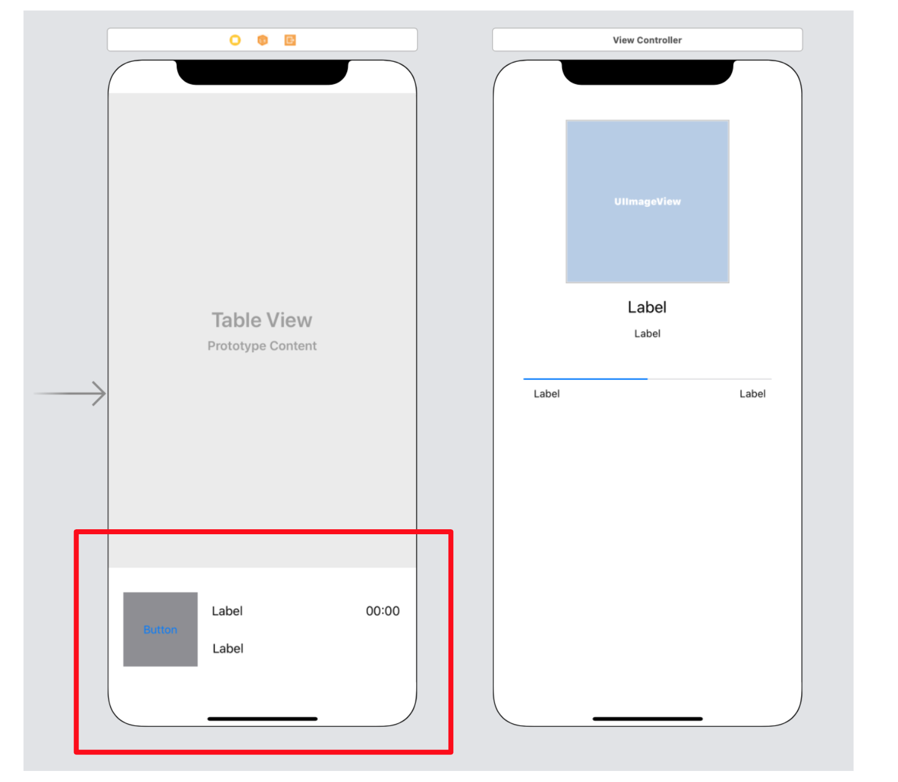

`Desarrollo Mobile` > `Swift Intermedio 2`
	
## Titulo del Ejemplo 

### OBJETIVO 

- De los elementos previamente añadidos a la vista, crear un submodulo mediante XIBs.

#### REQUISITOS 

1. Proyecto de la Sesión-01, Music App.
2. Xcode 11.

#### DESARROLLO

En el proyecto de la Sesión-01 se creó lo encerrado en rojo.




1.- Mover esos elementos de **UI** a una vista de **XIB**.

Por lo tanto, ese ViewController solo tendrá un TableView. 

Nota: El subview se agregará después por código.

<details>
	<summary>Solución</summary>
	<p> Crear un nuevo XIB como lo hicimos en el ejemplo 01.</p>
	<p>Este XIB necesitará una clase, creamos un archivo de subclase de UIView. Enlazarlo con este XIB.</p>
	<p>Agregar los elementos cortados en el nuevo XIB y agregar constraints.</p>
	<p>Los constraints son de dimensión, alto y ancho. y de posición.</p>
	
```	
class PlayerView: UIView {
  
  @IBOutlet var contentView: UIView!
  @IBOutlet weak var lblSongName: UILabel!
  @IBOutlet weak var lblAlbumName: UILabel!
  @IBOutlet weak var lblSongProgress: UILabel!
  
  // For using in Code
  override init(frame: CGRect) {
    super.init(frame: frame)
    commonInit()
  }
  
  // For using in IB
  required init?(coder: NSCoder) {
    super.init(coder: coder)
    commonInit()
  }
  
  private func commonInit() {
    Bundle.main.loadNibNamed("PlayerView", owner: self, options: nil)
    addSubview(contentView)
    contentView.frame = self.bounds
    contentView.autoresizingMask = [.flexibleHeight, .flexibleWidth]
  }

  @IBAction func play(_ sender: Any) {

  }  
}
```

</details> 

