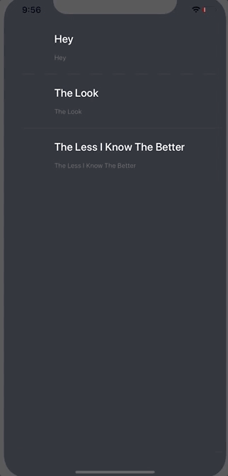
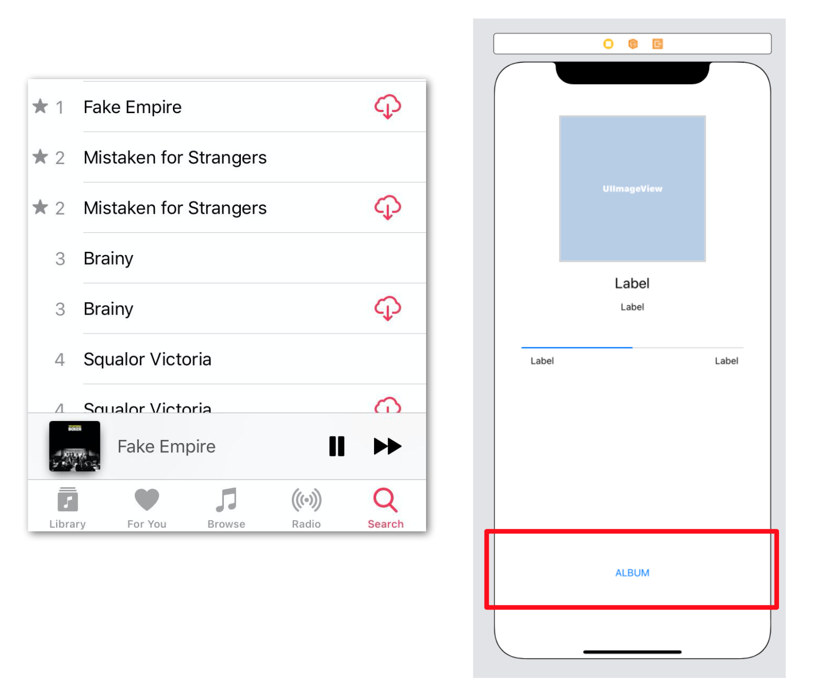
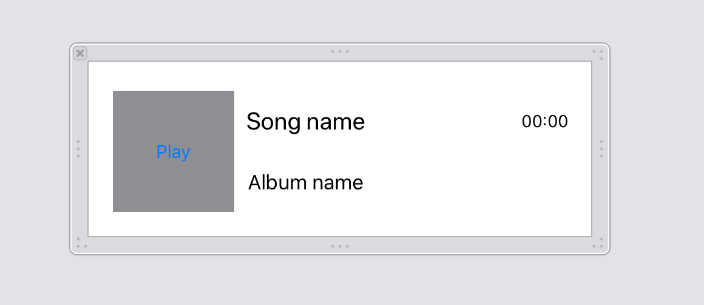

`Desarrollo Mobile` > `Swift Intermedio 2`
	
## Creando submodulos con XIBs y nuevos flujos de navegación.

### OBJETIVO 

- Lo que esperamos que el alumno aprenda 

#### REQUISITOS 

1. El proyecto mas reciente de MusicApp.
2. Xcode 11

#### DESARROLLO

La meta es ajustar el proyecto para que se parezca al siguiente.

Primero, modular.

1.- En el Main Storyboard o si se desea, en un XIB. 
Crear una vista que tenga:

	- Un TableView
	- Una cell personalizada

Para mostrar las canciones de un Álbum.

Similar a la imágen:

Además agregar un botón de Album, este nos enviará a la segunda vista.

3.- Ajusta las vistas, table views e imágenes para que luzca un flujo mostrado.

Solicita a tu instructor los iconos e imágenes.

	
Solución

	
Crear celdas personalizadas para cada tableview.

	
	
En los dos view controllers donde tenemos UITableView, implementar un DEMO de contenido, es decir, agregar datos simples de cadena de texto solo para mostrar el funcionamiento de las celdas personalizadas. 

	
En la vista de reproducción de audio, agregar los botones de Play, next y previous song.

	
En la vista de reproducción de audio, agregar un botón que permita mostrar el album y ademas ir a dicha vista./p>

 
