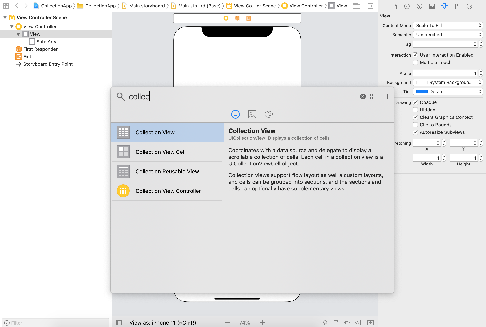
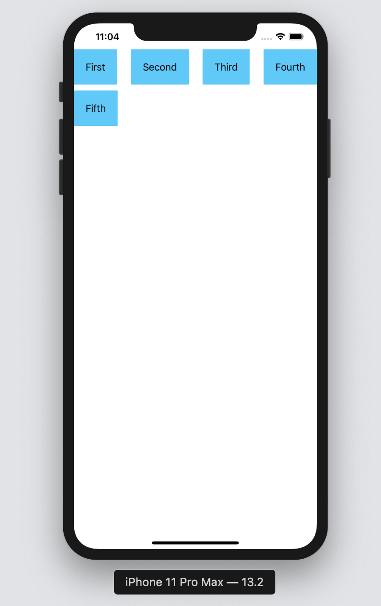
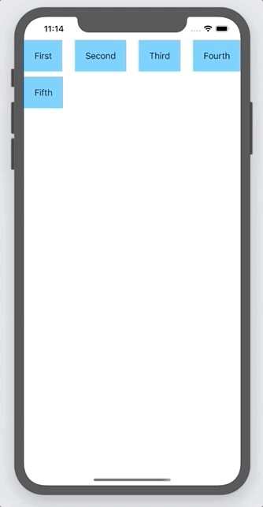

`Desarrollo Mobile` > `Swift Intermedio 2`

## CollectionView with DetailView

### OBJETIVO 

- Implementar el componente de UICollectionView con vista de detalle, de manera muy generica.

#### REQUISITOS 

0. Nociones de implementación de UITableView.
1. Xcode 11

#### DESARROLLO

Crear un nuevo proyecto.

En el Viewcontroller agregar un elemento de CollectionView.

Así como se implementa un TableView, implementar un CollectionView que muestre una celda personalizada.

Al dar click en la celda, ir a una vista de detalle.

	
Solución

	
 Agregar un UICollectionView al ViewController del Storyboard.

	
 Agregar un nuevo ViewController y su clase, este será el DetailViewController.

	
 Crearemos una Cell customizada para CollectionView. Le agregaremos un Label.

	
 En el ViewController principal, implementaremos el código similar a un TableView.

 

Resultado esperado:

