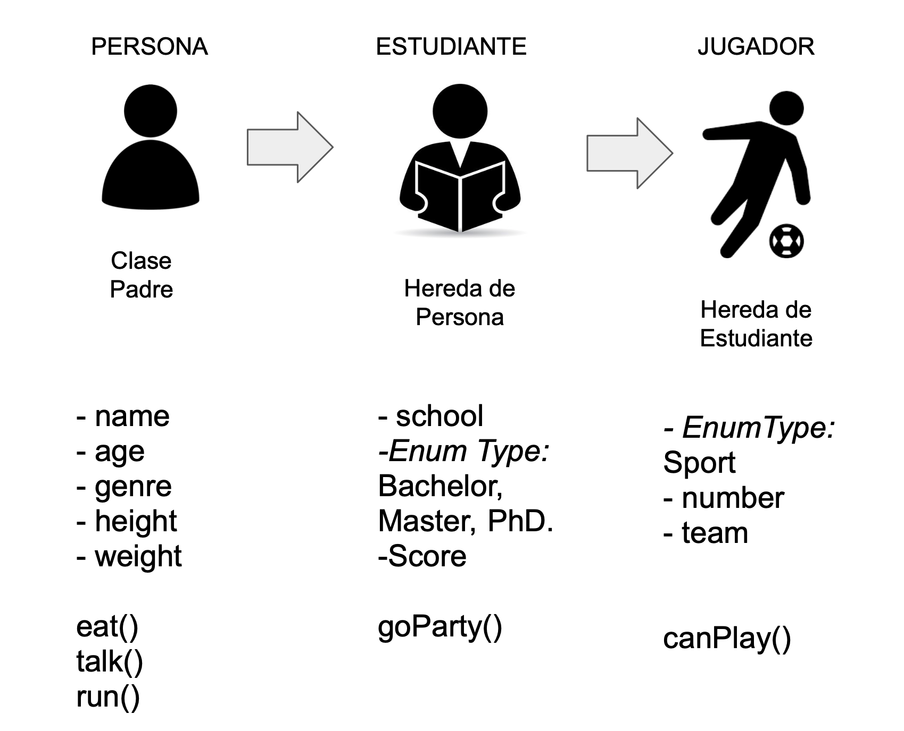

`Desarrollo Mobile` > `Swift Intermedio 2`

## Polimorfismo y el operador "as"

### OBJETIVO

- Comprender como funciona el polimorfismo en Swift y el uso de los diferentes operadores "as" existentes.

#### REQUISITOS

1. Xcode 11
2. Playgrounds

#### DESARROLLO



1.- Crear un playground nuevo.

2.- En ese playground definir las siguientes enumeraciones, si el alumno lo desea puede agregar mas opciones y valores.

```
enum Genre {
  case male
  case female
  case other
}

enum EducationLevel {
  case bachelor
  case master
  case Phd
}

enum Sport {
  case soccer
  case futbol
}
```

3.- Comenzaremos creando la clase padre `Person`, recuerda que en el diagrama aparecen las variables con un guión **-** y los métodos con un paréntesis al final del nombre.

```
class Person {
  
  var name: String
  var age: Int
  var genre: Genre
  var height: Float?
  var weight: Float?
  
  init(name: String, age: Int, genre: Genre) {
    self.name = name
    self.age = age
    self.genre = genre
  }
  
  //Methods
  func eat() {
    print(#function)
  }
  
  func talk(){
    print(#function)
  }
  
  func run() {
    print(#function)
  }
}
```

4.- Creamos la primera herencia, de clase `Student` con `Person`.
Utilizamos `super` para escribir las propiedades de la clase padre.

```
class Student: Person {
  var school: String?
  var educationLevel: EducationLevel?
  var academicAverage: Float?
  
  init(name: String, age: Int, genre: Genre, school: String, educationLevel: EducationLevel){
    self.school = school
    self.educationLevel = educationLevel
    super.init(name: name, age: age, genre: genre)
  }
  
  func goParty() {
    print(#function)
  }
}
```

5.- Creamos la siguiente clase, `Player`. Este hereda de `Student`.

```
class Player: Student {
  var sport: Sport?
  var number: Int?
  var team: String?

  func canPlay() {
     print(#function)
  }
}
```

6.- Finalmente realizamos la instancia de clases y utilizamos el operador `as`.

Nota: Crear tantas instancias como se deseen.

```

let ric = Person(name: "Ric", age: 28, genre: .male)
let student = Student(name: "Ricardo", age: 28, genre: .male, school: "Bedu", educationLevel: .bachelor)

let cast = student as Person
cast.weight

let downcast = ric as? Student
downcast?.academicAverage
```