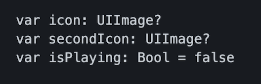

`Desarrollo Mobile` > `Swift Intermedio 2`

## Postwork - Sesión 03 ##

**Objetivo**
 
- Implementar enum para definir valores de manera descriptiva
- Crear una subclase de UIButton e implementar lo que se describe en el desarrollo para que el botón muestre visualmente el estado en que se encuentra.

**REQUISITOS**
1. Lo necesario para desarrollar el ejemplo está en los retos de esta sesión, básate en ellos para preparar tu entregable.

**Antes de empezar**

**⚙️ Setup**
- Asegúrate de tener XCode instalado (la versión 12.5.1 es suficiente).
- El proyecto de MusicApp que has estado utilizando en este módulo.

**Desarrollo**
Se proporciona un código de ayuda en la clase HighlightButton del repositorio, en la sección del Postwork.

También puedes usar este icono para cambiar el estado del botón.

De la clase de UIButton creada, implementa una funcionalidad de Highlight. Es decir, al presionar el botón este se debe mostrar distinto, para informar al usuario que algo está ocurriendo.
 
 
 Implementa lo siguiente:
1. En nuestro archivo “Modelos.swift”, crea un enum llamado PlayerStates con los casos de play, pause, next y previous.

2. Agrega una clase que herede de UIButton y contenga las propiedades de icon, secondIcon e isPlaying

    
- En un inicializador haz un override al método draw e implementa un borde redondeado y un color por default.
    

3. En nuestra clase TrackTableViewCell cambia  lo necesario para implementar el uso de este botón en las celdas. Cuando el usuario toque el botón, debe presentarse el icono para el estado “highlighted”
