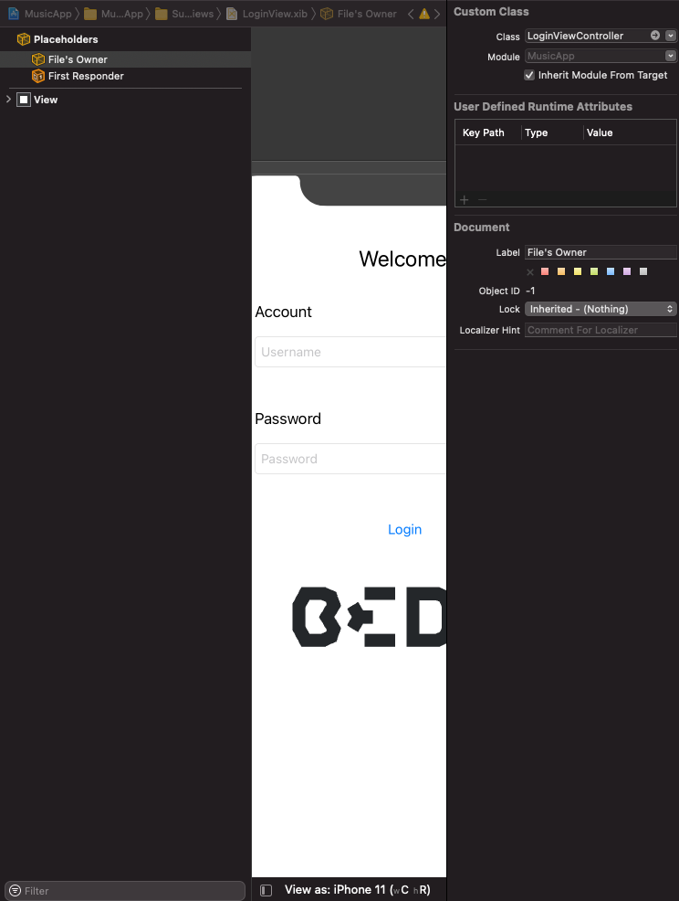

`Desarrollo Mobile` > `Swift Intermedio 2`

## Closures

### OBJETIVO

- Una vez vista la teoria de los closures, implementar la sintaxis mediante un ejemplo.

#### REQUISITOS

1. Xcode 11.
2. Playgrounds.

#### DESARROLLO

1.- Comenzamos declarando una función. Esta función debe tener parametros y un valor de retorno.

2.- Declarar una variable de tipo closure. Este closure tendra dos parametros y un tipo de retorno.

3.- Luego implementar el mismo closure, pero sin return y tambien utilizando short hand para no especificar nombres de variables.

