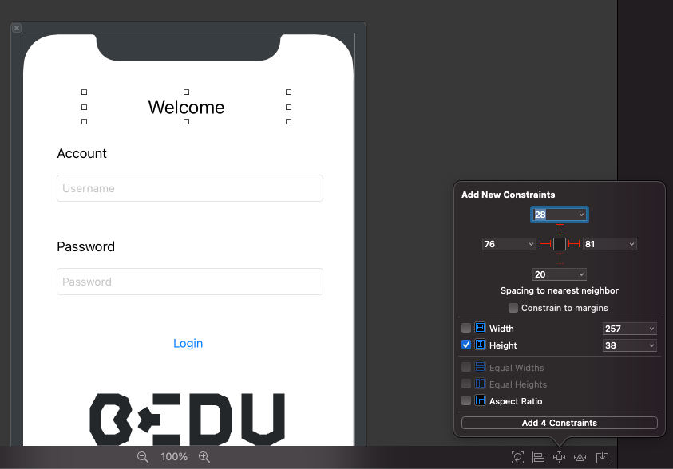

`Desarrollo Mobile` > `Swift Intermedio 2`

## Ejemplo 02 - Sesión 04 - Constraints, Autolayout y Constraints mediante código.

### OBJETIVO

- Implementar _Constraints_ mediante **Interface Builder**.
- Implementar componentes con código y aplicarles _Constraints_.

#### REQUISITOS

1. Xcode 12+.
2. El proyecto de ejemplo de esta sesión.

#### DESARROLLO

1.- Abre el proyecto de ejemplo de esta sesión.

2.- Abre el **LoginView.xib**.

3.- En _Interface Builder_ selecciona el **UILabel** de **Welcome**

4.- En los controles avanzados, abre **Add New Constraints**

5.- Asignale los _Constraints_:
- Izquierdo (Leading)
- Derecho (Trailing)
- Arriba (Top)
- Alto (Height)

- 

6.- Abre la clase **LoginViewController.swift**

7.- En el método **viewDidLoad()** escribe el sig. código:
````
let image = UIImageView(image: UIImage(named: "logoBedu"))
image.translatesAutoresizingMaskIntoConstraints = false
self.view.addSubview(image)
image.leadingAnchor.constraint(equalTo: view.leadingAnchor, constant: 10.0).isActive = true
image.bottomAnchor.constraint(equalTo: view.bottomAnchor, constant: -10.0).isActive = true
image.trailingAnchor.constraint(equalTo: view.trailingAnchor, constant: 10.0).isActive = true
image.heightAnchor.constraint(equalToConstant: 100.0).isActive = true
````
Con esto, estas agregando una imagen con el Logo de **_Bedu_** alineada al borde inferior y con un alto de 100.0

