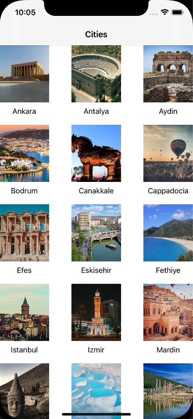

`Desarrollo Mobile` > `Swift Intermedio 2`

## Ejemplo 04 - Sesión 04 - Implementando un CollectionView.

### OBJETIVO

- Implementar un **CollectionView**.

#### REQUISITOS

1. Xcode 12+.
2. Descargar este proyecto de ejemplo para practicar:
[Archivo de ejemplo](Cities_CollectionView_initial.zip)

- Este proyecto ya incluye:
* Un **NavigationController**
* Un **Grupo de Assets**

#### DESARROLLO

1.- Abre el proyecto de ejemplo para esta práctica.

2.- Crea los siguientes grupos:
* **Models**(en raíz del proyecto)
* **ViewControllers** (en raíz del proyecto)
* **Views** (en raíz del proyecto)
* **Cells** (dentro de **Views**)
* 

3.- Dentro de **Models**, crea el _Modelo_ **City.swift** con las sig. propiedades:
* _image_ tipo **String**
* _name_ tipo **String**
* 

4.- Dentro de **Cells**, crea un **UICollectionViewCell** y llámalo **CityCollectionViewCell**.

5.- Crea 2 **IBOutlet**
* _cityImageView_ de tipo **UIImageView**
* _cityNameLabel_ de tipo **UILabel**
* 

6.- Dentro de **ViewControllers**, crea un controlador y llamalo **CityCollectionViewController** que implemente del protocolo **UICollectionViewController**
* Define una variable estática con el nombre de la celda: **private let reuseIdentifier = "Cell"**
* 

7.- A continuación, crea un arreglo con el modelo **City**
* 

8.- Implementa los siguientes métodos en la clase:
* 
* 

9.- Crea un **CollectionViewController** en el **Main.storyboard**, haz las conexiones pertinentes y agrega los constraints que consideres.
* 

10.- Este es el resultado de la app en ejecución:
* 

#### NOTA IMPORTANTE:
Puedes descargar la versión completa desde el siguiente enlace.
[Ejemplo ScrollView](Cities_CollectionView_final.zip)