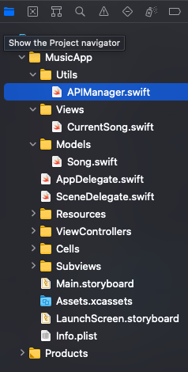
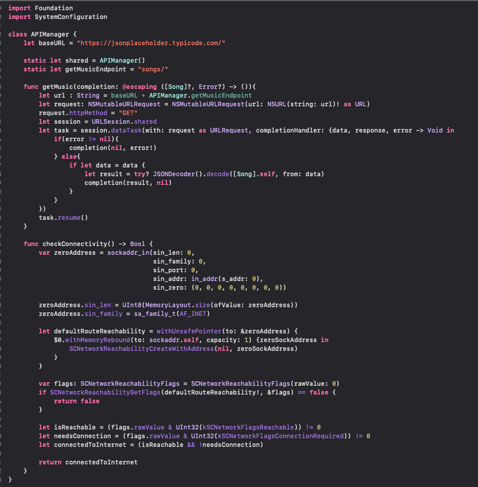
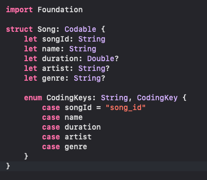

`Desarrollo Mobile` > `Swift Intermedio 2`
## Postwork de la Sesión 02

## Al final de la sesión, tendrás implementado completamente los sig. puntos:
* APIManager
* Detectar conexión a internet
* Protocolo codable
* Coding Keys

### OBJETIVO

- El proyecto al final del módulo deberá quedar con una estructura ordenada y con los requerimientos anteriores implementados.

#### REQUISITOS

1. Proyecto de la sesión en curso.
2. Xcode 12+.

#### DESARROLLO

- Realiza la implementación de todos los retos en tu proyecto.

	* [Reto 01](Reto-01)
	* [Reto 02](Reto-02)
	* [Reto 03](Reto-03)
	* [Reto 04](Reto-04)
	* [Reto 05](Reto-05)

#### La estructura final del proyecto deberá de verse como a continuación:

