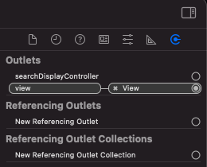

`Desarrollo Mobile` > `Swift Intermedio 2`
	
## Reto 01 - Sesión 04 - Archivos .xib

### OBJETIVO 

- Implementar conexiones y cambiar el **rootViewController** en el **SceneDelegate**

#### REQUISITOS 

1. Xcode 12+.
2. El proyecto del [Ejemplo 01](Ejemplo-01).

#### DESARROLLO

1.- Abre el proyecto del ejemplo.
* Asegurate de abrir la vista **LoginView**.
* Has las conexiones de los **IBOutlets** de la clase **LoginViewController** que creaste.
* Has la conexión del botón con el **IBAction**.
* Elimina la referencia de **ContentView** y agrega la referencia de **View**.

2.- Borra la clase **LoginView.swift**.

3.- En el **SceneDelegate** cambiá el **ViewController** de inicio, por el **LoginView** y haz que el **RootViewController** sea la nueva instancia.

        
Solución

        
 let scrollVC = ScrollViewController(nibName: "ScrollViewController", bundle: nil)

        
 let loginVC = LoginViewController(nibName: "LoginView", bundle: nil)

        
 ... .rootViewController = loginVC

