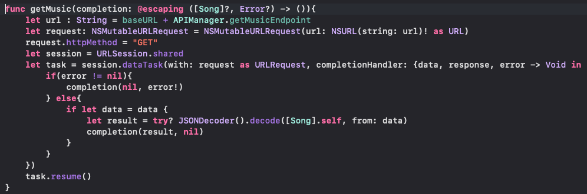
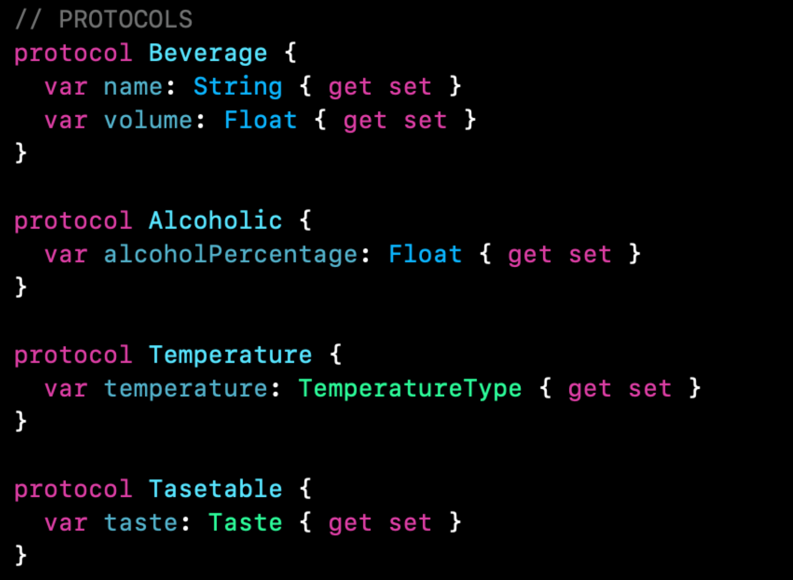
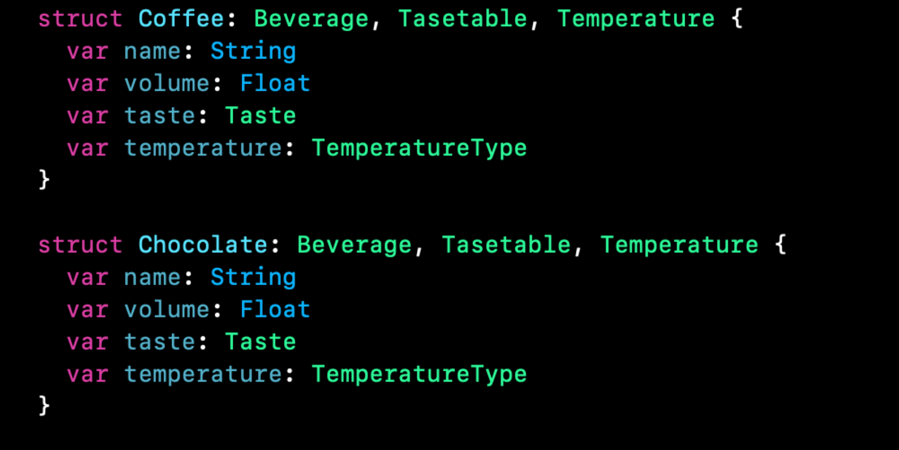

`Desarrollo Mobile` > `Swift Intermedio 2`

## Protocol Creation

### OBJETIVO

- Crear definiciones y protocolos para definir características. Luego conformar dichos protocolos por una estructura como un Struct o Clase.

#### REQUISITOS

1. Xcode 11
2. Playgrounds

#### DESARROLLO

1.- Realizar protocolos e implementarlos con Structs.

Nos basaremos en las definiciones previamente creadas:

2.- Crearemos **dos** definiciones de bebidas más, esta vez para Bebidas calientes.

	- Cafe
	- Chocolate

Además de crear protocolos para definir sabor amargo y temperatura.

Al conformar los protocolos no importa que haya ciertas similitudes.

