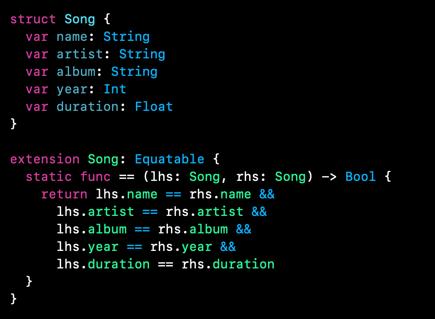

`Desarrollo Mobile` > `Swift Intermedio 2`

## Postwork

### OBJETIVO

- Con lo aprendido en clase, implementar mutabilidad y protocolos.

#### REQUISITOS

1. Reto-03 terminado.
2. Playgrounds
3. Ultimo Proyecto de Music App.

#### DESARROLLO

Con base al Reto-03, crearemos un protocolo con los parámetros que ya tenemos en la estructura: `struct Song`.

Además agregar una función de tipo mutating que permita cambiar el valor de un objeto de esta estructura para saber si la canción está en reproducción o no.

Al finalizar este código, agregarlo al proyecto de MusicApp en el archivo de Models.

Nota: El alumno debera llevar un archivo de audio en formato **.mp3** para poder relizar la práctica.