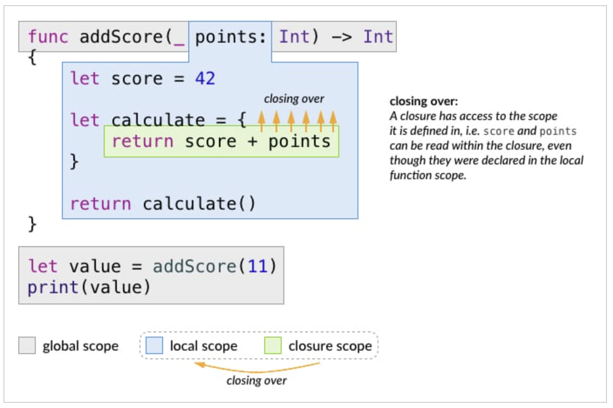

`Desarrollo Mobile` > `Swift Intermedio 2`

## Reto 01 - Sesión 05 -	Closures

### OBJETIVO 

- Reforzar el uso de **Closures**.

#### REQUISITOS 

1. Xcode 12+.
2. Playgrounds.

#### DESARROLLO

## Parte 1

1. Crea un Playground nuevo.
2. Crea un Closure que multiplique un número cualquiera * 2.

<details>
	<summary>Solución</summary>
	<p> Se escribe esta constante dentro del playground </p>

```
let integerMultiplier = {
  $0 * 2
}

let number = integerMultiplier(10)
print(number) // imprime 20
```
</details>

## Parte 2

1. Haz un cálculo mental y comenta con tu mentor el resultado del siguiente closure:

```
func addScore(_ points: Int) -> Int {
  let score = 42
  let calculate = {
    return score + points
  }
  return calculate()
}

let value = addScore(11)
// que número piensas que será el resultado?

```

<details>
  <summary>Solución</summary>
  <p> El resultado es <b>53</b>, aquí la explicación</p>
  <p> 1. Se define la función addScore(_:) que regresará un score, basado en el parámetro points y el score "anterior" de 42 </p>
  <p> 2. Después dentro de la función se define el closure de calculate. Este simplemente agrega score y points y regresa el resultado. La función llama al closure con calculate()</p>
  <p> 3. Finalmente, la función addScore(_:) es llamada, asignándole un valor e imprimiendolo </p>
  <p> El closure calculate, captura ambos, score y points, Ninguna de esas variables están declaradas localmente dentro del closure, aunque el closure puede tomar los valores, eso es debido a la característica de capturing de un closure</p>

* Entendiendo la característica _capturing_

</details>

#### Nota para el mentor:
Favor de revisar el siguiente contenido:
https://learnappmaking.com/closures-swift-how-to/ (en Inglés).