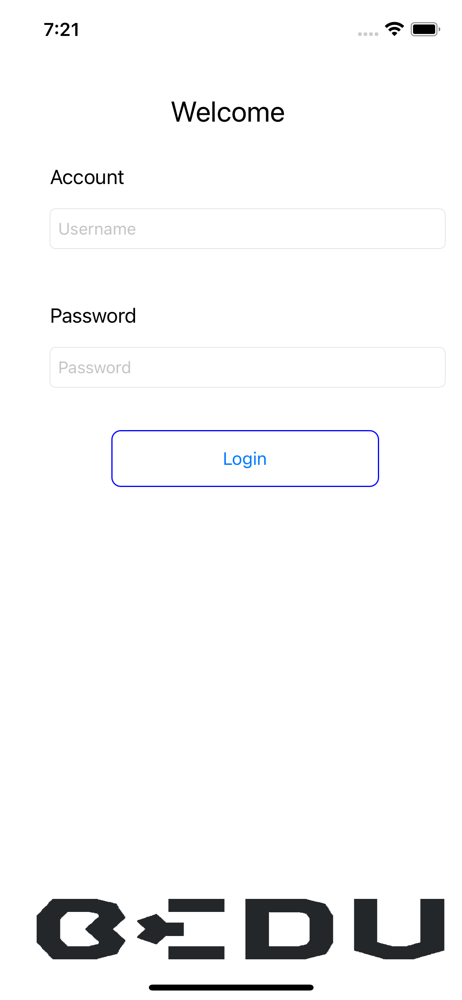

`Desarrollo Mobile` > `Swift Intermedio 2`
	
## Protocols, Mutating y Structs

### OBJETIVO 

-  Migrar la funcionalidad del `Enum` a un `Struct` que conforme el protocolo `Playable`.

#### REQUISITOS 

1. Lo necesario para desarrollar el ejemplo o el Reto 

#### DESARROLLO

Migrar la funcionalidad del Enum a un Struct que conforme el
protocolo Playable.



Crear un `Struct` que replique la misma funcionalidad que el Enum.

Debe conformar el protocolo `Playable`.

<details>
	<summary>Solución</summary>
	<p> Al crear una estructura, conformaremos el Protocolo Playable.</p>
	```
	struct Song: Playable {
	}
	```
	<p> Replicamos la logica, algo similar, basicamente es poder cambiar un valor de un property existente en la estructura. </p>

```
struct Song: Playable {
  var isPlaying: Bool
  mutating func play() {
    self.isPlaying = !isPlaying
  }
}
```

<p> Al crear una instancia probamos que efectivamente se cambie el valor. </p>

```
var s = Song(isPlaying: true)
s.play()
s.isPlaying
```
</details> 
