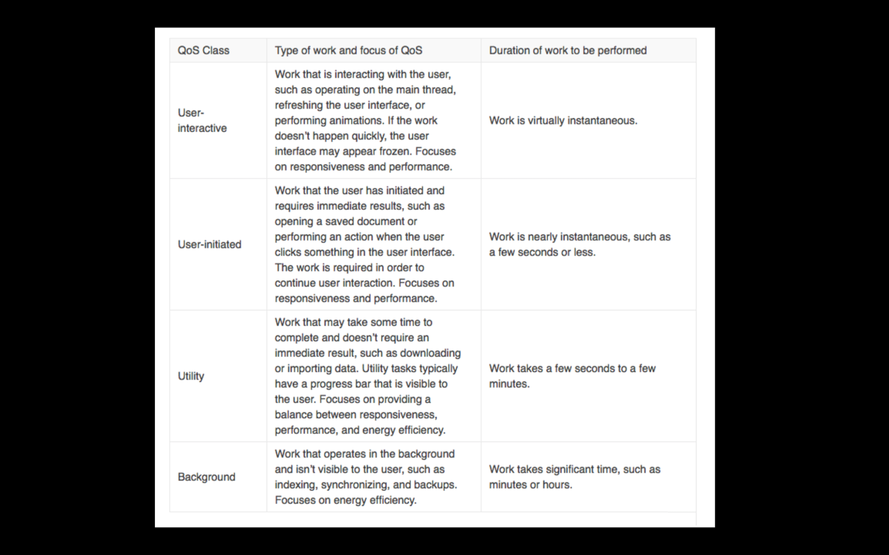
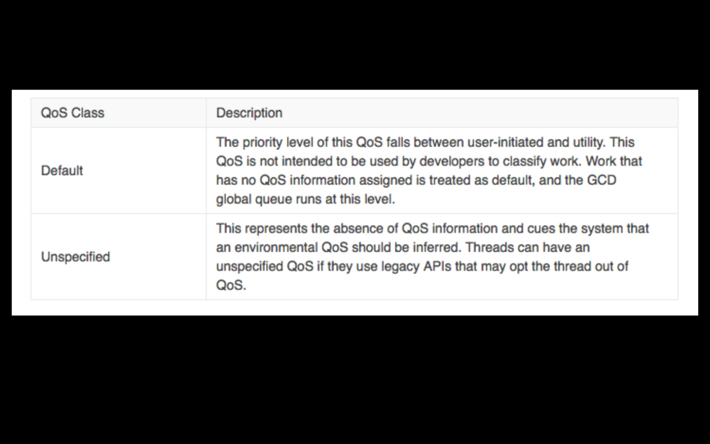

`Desarrollo Mobile` > `Swift Intermedio 2`

## Hola mundo Queues

### OBJETIVO

- Comprender la importancia del `Quality of Service` en queues.

#### REQUISITOS

1. Playgrounds
2. Xcode 11

#### DESARROLLO

Se realizará un experimiento donde se pueden comparar dos procesos simultaneos.

Crear un `queue` con un `QoS` definido.

1.- Probar con todos los `QoS` previamente vistos en las diapositivas.

2.- Ver el *Output* en la consola y comparar resultados.

3.- Comenzamos creando un `queue` con un `QoS` en *userInteractive*. 

4.- Ir variando su valor hasta llegar a *backgound* para ir viendo cómo se ejecuta el código.

5.- El queue se ejecutará tanto como **síncrono** como **asíncrono**.
