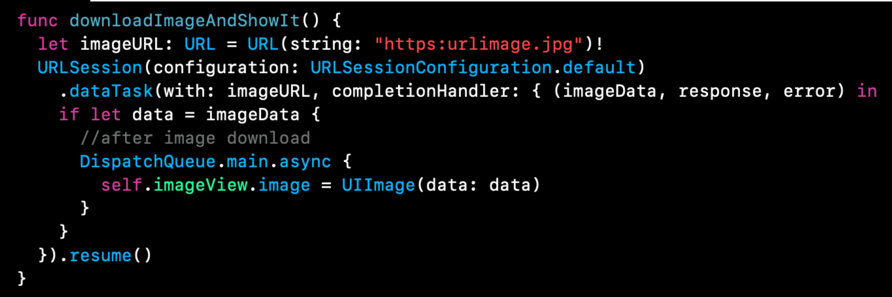

`Desarrollo Mobile` > `Swift Intermedio 2`

## App que descarga imagen de internet

### OBJETIVO

- Crear una app que permita visualizar una imagen de internet en un UIImageView.

#### REQUISITOS

1. Xcode 11
2. Conectividad a internet.

#### DESARROLLO

Crearemos una pequeña app que permite descargar una imagen de internet y mostrarla en un ImageView.

1.- Comenzamos creando un proyecto en Xcode con Swift y Playgrounds como configuración inicial.

2.- Vamos al `Storyboard`, agregamos un `UIImageView` y conectamos el `IBOutlet` con la clase de su ViewController.

3.- Vamos al `ViewController` e implementamos la funcion a continuación, incluyendo la `URL` de la imagen que se desee mostrar.

La imagen no se mostrará por si sola, la funcion agregarla al viewDidLoad y ademas necesitamos agregar la sig. configuración al proyecto.

Listo, el proyecto deberia poder mostrar la imagen.