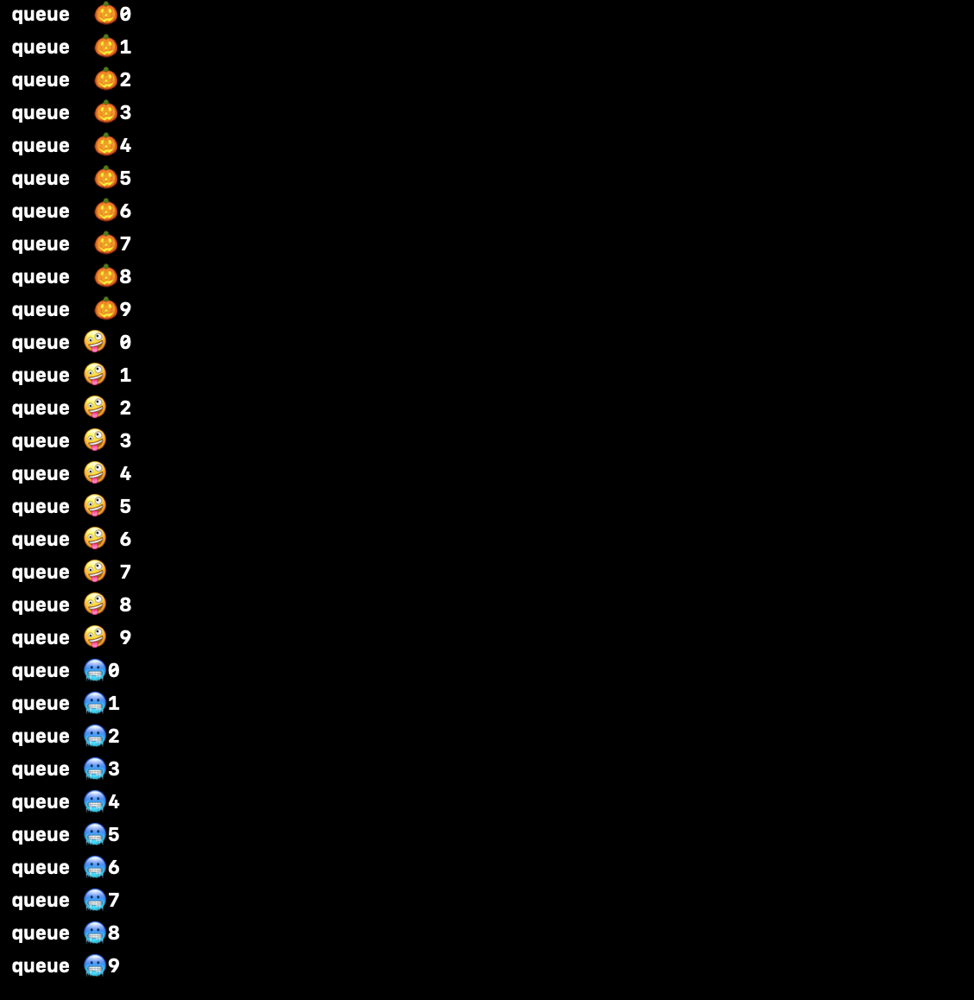
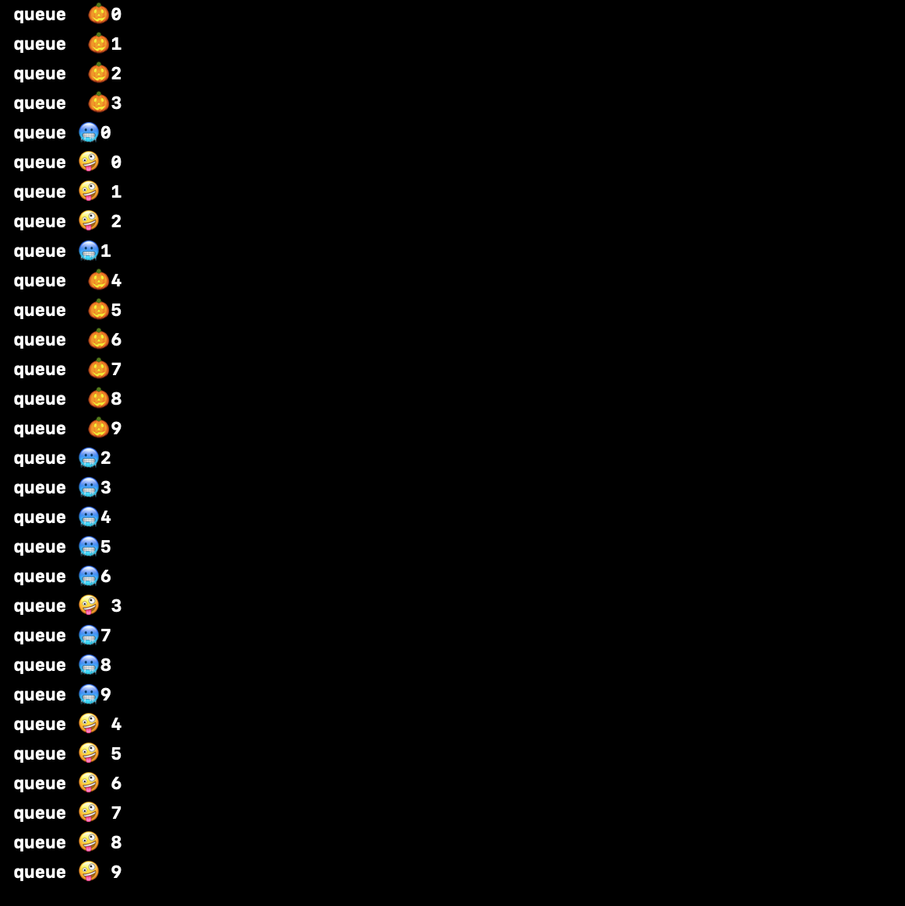

`Desarrollo Mobile` > `Swift Intermedio 2`

## Reto de tasks y concurrencia

### OBJETIVO 

- Ver como funciona la concurrencia con multiples tasks.

#### REQUISITOS 

1. Playgrounds
2. Xcode 11

#### DESARROLLO

1.- Crear un `queue` y asignarle tres `tasks` basados en *for-loops* que muestren una salida parecida a estas dos.

Salida ordenada:



Salida desordenada:



<details>
	<summary>Solución</summary>
<p> Declararemos un queue:</p>
	
```
	let queueConcurrent = DispatchQueue(label: "com.bedu.queues", qos: .utility)
```
<p> Luego una función con tres ciclos for.</p>

```
func concurrentQueues(){
    queueConcurrent.async {
        for i in 0..<10 {
            print(" queue  🎃\(i)")
        }
    }
    
    queueConcurrent.async {
        for i in 0..<10 {
            print(" queue 🤪 \(i)")
          
        }
    }
    
    queueConcurrent.async {
        for i in 0..<10 {
            print(" queue 🥶\(i)")
        }
    }
}
```

<p>Para lograr el `output 1`, el queue es como lo declaramos.</p>

<p>Para lograr el `output 2`, hay que agregar el attribute de concurrent.</p>

```
let queueConcurrent = DispatchQueue(label: "com.bedu.queues", qos: .utility, attributes: .concurrent)
```

</details> 


