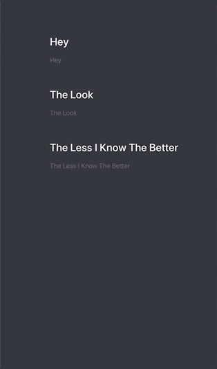

`Desarrollo Mobile` > `Swift Intermedio 2`

	
## Animar ProgressBar

### OBJETIVO 

- Con base al proyecto de Music App, animar el progress bar al presionar Play.

#### REQUISITOS 

1. Ultimo proyecto de Music App.
2. Xcode 11

#### DESARROLLO

En la app de música, crear un código que permita avanzar la barra de progreso.

De momento no es necesario reproducir audio.



<details>
	<summary>Solucion</summary>
	<p> Abrimos el proyecto de MusicApp y nos dirigimos a la clase PlayerViewController.</p>
	<p>En esta clase agregaremos el progress de 0 al ProgressBar dentro de viewdidload().</p>
	
```
progressBar.setProgress(0.0, animated: true)
```

<p>Nos apoyaremos de un contador, el contador iniciará en 0, sera una variable tipo flotante. Recuerda que el progressbar por defecto avanza en decimales hasta llegar al número 1.</p>
	
```
  var contador: Float = 0.0
```

<p>Atacaremos este problema con un DispatchQueue global con un main async anidado, este contendra un ciclo que irá incrementando en valores de 0.1 para llenar la barra de progreso.</p>

```
    DispatchQueue.global(qos: .background).async {
      DispatchQueue.main.async {
        while self.contador <= 1 {
          self.contador += 0.1
          UIView.animate(withDuration: 2.0, delay: 0, options: [], animations: { [unowned self] in
            self.progressBar.setProgress(self.contador, animated: true)
          })
        }
      }
    }
 ```

</details> 
