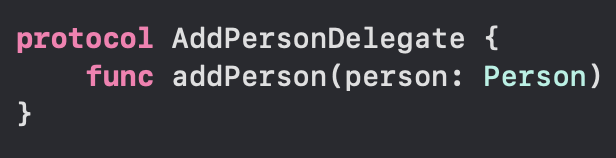

`Desarrollo Mobile` > `Swift Intermedio 2`

## Ejemplo 02 - Sesión 07 - Protocolos y delegados y cómo llamar a los métodos desde el delegado.

### OBJETIVO

- Comprender cómo se ejecutan los métodos de los delegados.

#### REQUISITOS

1. Xcode 12+
2. El proyecto del postwork

#### DESARROLLO

* En este ejemplo analizaras la implementación de un delegado.

1. Abre la app. de ejemplo del postwork (link arriba).

2. Abre **AddPersonViewController**.

3. Observa como está definido el protocolo que implementara al delegado.

4. Observa como está declarado el delegado (y observa que al final está marcado como _optional_).

5. Dentro de la acción de **addPerson** observa como se llama al método del delegado.

6. Abre la clase **ViewController** del Ejemplo.

7. En la parte final, observa la extensión del **ViewController** que implementa el método del delegado.

8. Este método **addPerson** hace la implementación en este **ViewController** y se manda a llamar desde **AddPersonViewController** pasándole el parámetro requerido.
