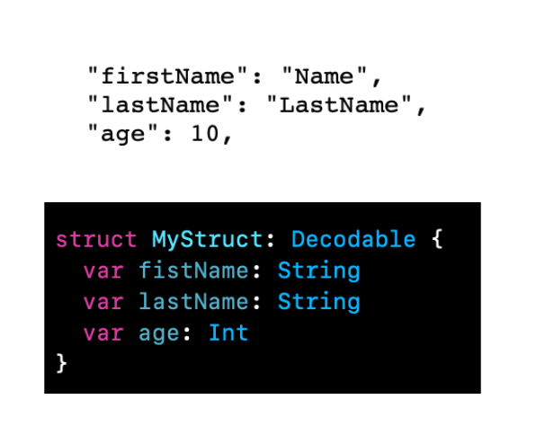
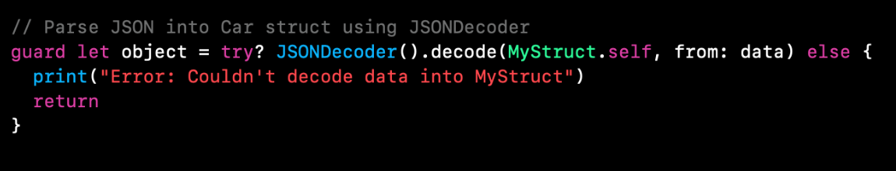

`Desarrollo Mobile` > `Swift Intermedio 2`


## JSON object a Structs, Decodable Protocol

### OBJETIVO

- Crear los modelos que asemejen al JSON para poder decodificarlos.

#### REQUISITOS

1. Xcode 11
2. Playgrounds
3. Conectividad a Internet

#### DESARROLLO

Utilizar el JSON de base para crear Structs que puedan conformar el protocolo Decodable.

Swift permite convertir un JSON a una Struct/Objeto mediante el protocolo Decodable.

Basandonos el en JSON anterior, podemos proponer un Struct

Las variables del Struct deben coincidir con el nombre de las variables del JSON.



Para poder hacer la conversión, utilizamos `JSONDecoder()`.
 



El URL del JSON propuesto puede cambiar, pero de cambiar el JSON, cambiarán los Structs.

#### Solucion

```
import UIKit

struct Address: Decodable {
  var streetAddress: String
  var city: String
  var state: String
  var postalCode: Int
}

struct Phone: Decodable {
  var type: String
  var number: Int
}

struct MyStruct: Decodable {
  var fistName: String
  var lastName: String
  var age: Int
  var address: Address
  var phoneNumber: [Phone]
}

let config = URLSessionConfiguration.default
let session = URLSession(configuration: config)

let url = URL(string: "https://gist.githubusercontent.com/richimf/0d18f9ba3e028fca677b39949fd92185/raw/c9b355b816864d3aa79bcacb93493a6608d841b8/file.json")!
let task = session.dataTask(with: url) { data, response, error in
  
  // ensure there is no error for this HTTP response
  guard error == nil else {
    print ("error: \(error!)")
    return
  }
  
  // ensure there is data returned from this HTTP response
  guard let data = data else {
    print("No data")
    return
  }
  
  guard let object = try? JSONDecoder().decode(MyStruct.self, from: data) else {
    print("fail")
    return
  }
  
  print("gotten json response dictionary is \n \(object)")
  // update UI using the response here
}

// execute the HTTP request
task.resume()

```