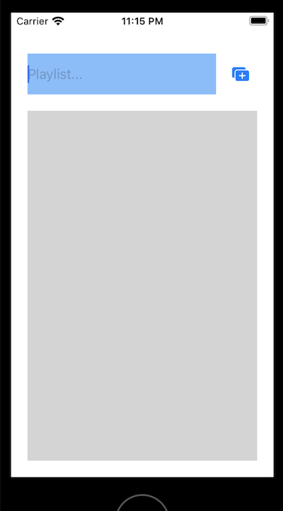
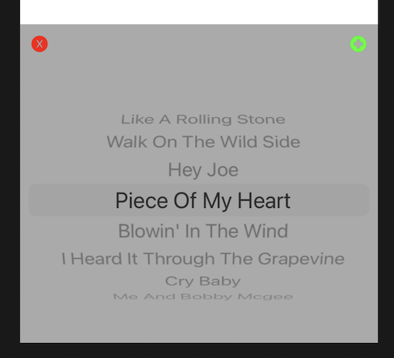

`Desarrollo Mobile` > `Swift Intermedio 2`

## Postwork - Sesión 07

**Objetivo**

- Implementar una vista para crear listas de reproducción (playlist).
- Implementar un método de un protocolo para eliminar canciones de la playlist,  llamándolo desde el delegado.
 
 **Instrucciones**

El objetivo de este entregable, es que implementes la programación orientada a protocolos en el proyecto del módulo, para dejar el desarrollo del reproductor musical con mayor estructura e interactividad entre sus elementos.

**⚙️ Requisitos**

- Xcode 12+
- Proyecto del módulo 

**Desarrollo**

Para el desarrollo de este postwork, toma en cuenta los siguientes elementos para el entregable de la sesión:

**Parte 1**
1. Crea un nuevo archivo, subclase de UITableViewController llamado PlayListDetailController.swift en tu proyecto. En esta clase:
- Crea 1 UITextField que contendrá  el nombre de la playlist.
- Crea 1 UIButton que servirá para implementar la funcionalidad de agregar canciones. (detallaremos este comportamiento en la parte 3) 
- Crea 1 UITableView donde se mostrarán las canciones que contenga la playlist

        **ProTip:** Una sugerencia de diseño de interfaz, es la siguiente:

        **Notas:** Pero tú puedes elegir los colores y estilos que prefieras para tus objetos. Utiliza Extensiones para personalizar los componentes

- Además declara una variable que pueda contener un Set de objetos Track
 
**Parte 2**

1. Crea un nuevo archivo, subclase de UIView llamado TracksPickerView.swift en tu proyecto. En esta clase:
- Declara un protocolo llamado TracksPickerDelegate en este protocolo declara un método, llámalo addTrack Este método debe recibir como argumento un objeto de tipo Track
- Crea 1 UIButton que debe remover la vista
- Crea 1 UIButton que debe notificar al delegado de la vista, para agregar la canción seleccionada en el PickerView, cuando el usuario lo toque.
- Crea 1 UIPickerView donde se mostrarán las canciones que tenemos disponibles en la App

        **ProTip:** Una sugerencia de diseño de esta interfaz, es la siguiente:
        

        **Notas:** Pero tú puedes elegir los colores y estilos que prefieras para tus objetos. Utiliza Extensiones para personalizar los componentes

- Además declara una variable que implemente el protocolo  TracksPickerDelegate llamada delegate

**Parte 3**

1. De regreso en PlayListDetailController:
- En el botón que colocamos, implementa lo necesario para que al tocarlo, se presente la vista  TracksPickerView en la pantalla (será un subview así que necesita un frame). 
- Debes  establecer su propiedad delegate para que nuestra clase PlayListDetailController pueda recibir cada canción que se haya seleccionado
- En la implementación del método del delegado deberás de agregar al Set ese objeto Track
- Por último actualiza la tabla.
