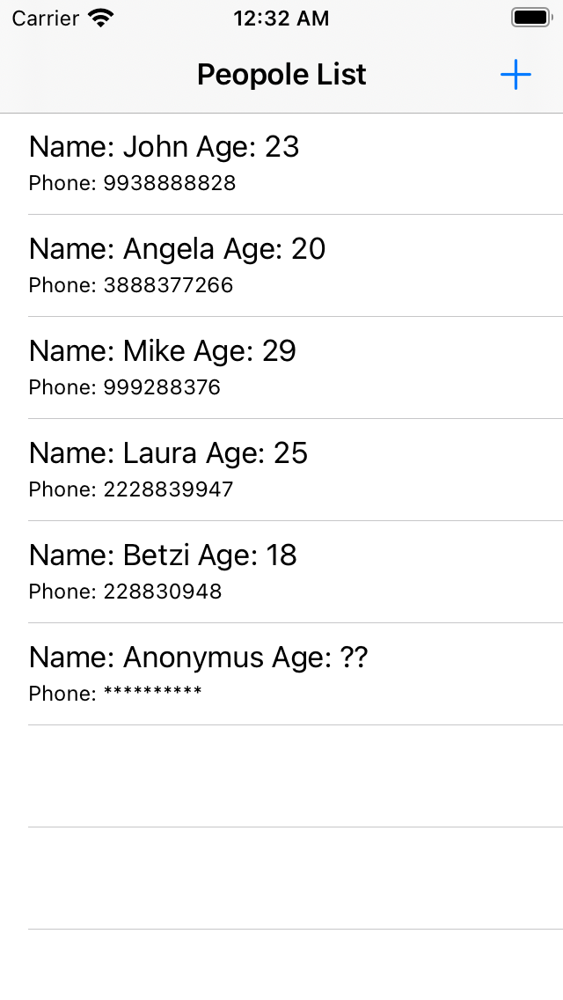

 `Desarrollo Mobile` > `Swift Intermedio 2`

	
## Descargar una Imagen mediante GET

### OBJETIVO 

- Crear un GET para obtener una imagen y mostrarla en el LIVE del Playground.

#### REQUISITOS 

1. Xcode 11
2. Conectividad a Internet
3. Playgrounds

#### DESARROLLO

Código que implementa un **GET** request de una imágen y además utiliza Dispatch Queues para poder mostrarla correctamente.

Crearemos un **GET** request para descargar una imágen.

En un nuevo Playground.

Implementar un código que permita obtener una imagen de internet y mostrarla.



El código aquí mostrado permite visualizar la imágen en el playground.

Usar **DispatchQueues**.

<details>
	<summary>Solución</summary>
	<p>Agregamos una URL valida.</p>
	<p>Creamos una función que invoque a performRequest(), dentro de un DispatchQueue.</p>
	
```
func perform() {
  let globalQueue = DispatchQueue.global(qos: .userInitiated)
   globalQueue.async {
     performRequest()
     //....
   }
}
```
<p>En el main thread actualizamos la vista del playground.</p>

```
func perform() {
  let globalQueue = DispatchQueue.global(qos: .userInitiated)
   globalQueue.async {
     performRequest()
    DispatchQueue.main.async {
      //Show Image
      PlaygroundPage.current.liveView = view
      PlaygroundPage.current.liveView
      
    }
  }
}
```
</details> 
