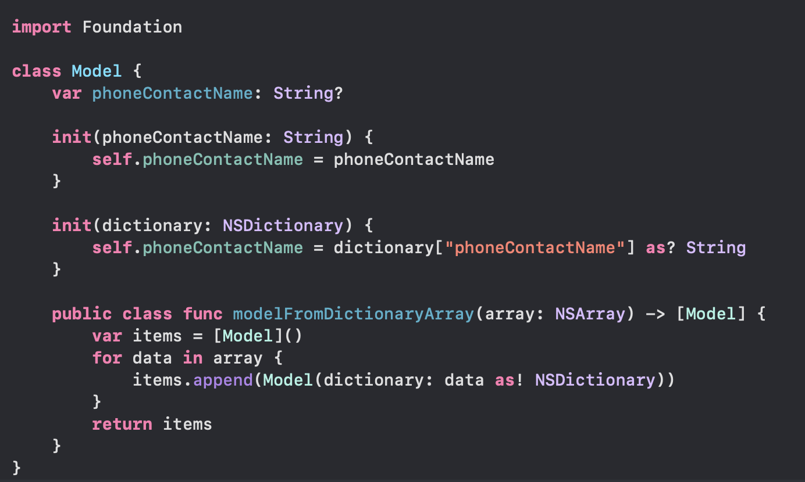

`Desarrollo Mobile` > `Swift Intermedio 2`

## Ejemplo 01 - Sesión 08 - Patron MVVM.

### OBJETIVO

- Ejemplo de implementación del **Model**.

#### REQUISITOS

* Observa la implementación básica del **Model**

#### DESARROLLO

1. Comprende la implementación del **Model**.

* Dentro del **Model** deberás de declarar la o las variables que requieres a modo de contenedor de datos.

	```
	var phoneContactName: String?
	```

* Creas dos inicializadores de la sig. forma:

	```
	init(phoneContactName: String) {
		self.phoneContactName = dictionary["phoneContactName"] as? String
	}

	init(dictionary: NSDictionary) {
        self.phoneContactName = dictionary["phoneContactName"] as? String
    }
	```
### Un Inicializador se usa cuando recibes un parametro tipo **String** y otro para cuando recibes un parametro tipo **Dictionary**.

* Crearás también un método que sea capaz de agregar los **items** del _Array_.

	```
	public class func modelFromDictionaryArray(array: NSArray) -> [Model] {
        var items = [Model]()
        for data in array {
            items.append(Model(dictionary: data as! NSDictionary))
        }
        return items
    }
	```
* De esta forma tendrás los datos listos dentro de tu **Model**.

* La implementación de tu **Model** deberá de verse de la sig. manera:

* 