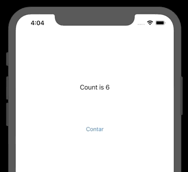

`Desarrollo Mobile` > `Swift Intermedio 2`

## Ejemplo MVP

### OBJETIVO

- Ejemplificar de la manera mas simple como implementar el patrón MVP.

#### REQUISITOS

1. Xcode 11

#### DESARROLLO

Se creará una pequeña app que cuente los taps del boton. 

Se crearán las capas de Modelo, Vista y Presentador.

Las partes que conforman este patrón:
El código del View
El de los modelos
El del presenter.

