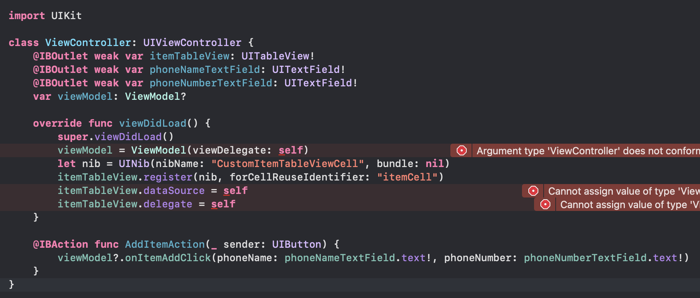

`Desarrollo Mobile` > `Swift Intermedio 2`

## Ejemplo 02 - Sesión 08 - Patron MVVM.

### OBJETIVO

- Ejemplo de implementación del **ViewController**.

#### REQUISITOS

* Observa la implementación básica del **ViewController**

#### DESARROLLO

1. Comprende la implementación del **ViewController**.

* Dentro del **ViewController** deberás de declarar la o las variables que requieres a modo de conexión entre la _Vista_ y el _Model_.

* Lo primero que tienes que hacer es crear una variable llamada **viewModel** del tipo **ViewModel** de tipo _Optional_.

  ```
  var viewModel: ViewModel?
  ```

* En el método **viewDidLoad()** harás la asignación del _delegado_ en **viewModel** a este mismo **ViewController**:

  ```
  viewModel = ViewModel(viewDelegate: self)
  ```
* Como estás utilizando una **Tabla** deberás también de implementar el registro de la **Celda** y asignar al **ViewController** como _delegado_.

  ```
  let nib = UINib(nibName: "CustomItemTableViewCell", bundle: nil)
  itemTableView.register(nib, forCellReuseIdentifier: "itemCell")
  itemTableView.dataSource = self
  itemTableView.delegate = self
  ```
* De esta forma tendrás el inicializador del **ViewControler** listo.

* Crea también un **IBAction** que se conecté con el **UIButton** de la vista, al cúal le pases **phoneName** y **phoneNumber** al **viewModel**.

```
    @IBAction func AddItemAction(_ sender: UIButton) {
        viewModel?.onItemAddClick(phoneName: phoneNameTextField.text!, phoneNumber: phoneNumberTextField.text!) //Estamos utilizando **forceUnwrap** lo puedes méjorar en la sección del Reto 02.
    }
```

* La implementación de tu **ViewController** deberá de verse de la sig. manera:

* 

# Nota: Por ahora aparecen algunos errores porque hace falta la implementación de los delegados que conformen a los protocolos que ya hemos definido, eso lo solucionarás en la sesión del Reto 02.