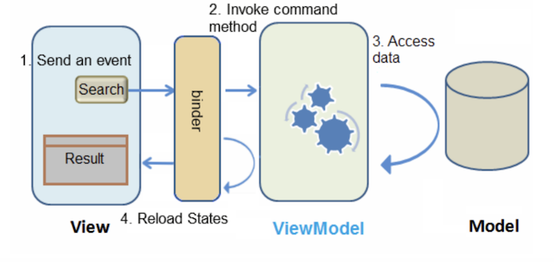
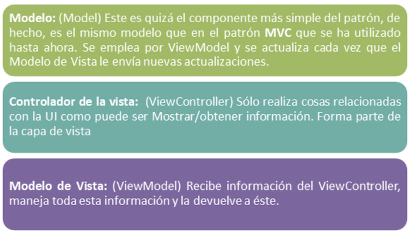
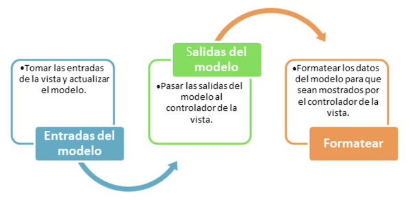
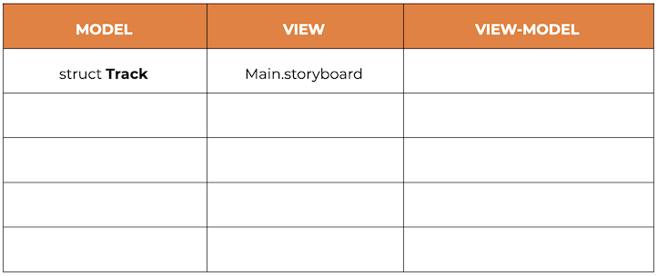
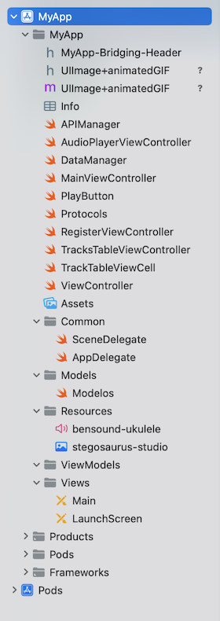

`Desarrollo Mobile` > `Swift Intermedio 2`

## Postwork - Sesión 08

**Objetivo**

- Reforzar las características de los patrones MVC y MVVM vistos a lo largo del módulo, para completar el desarrollo de la app musical. 
- Aplicar el patrón MVVM en el proyecto del módulo

**⚙️ Requisitos**

- Xcode 12+
- Proyecto del módulo
 
 **Instrucciones**
 
El objetivo de este entregable, es refactorizar el proyecto del módulo, para implementar la arquitectura MVVM

Antes de entrar en la refactorización, es esencial que entiendas las principales diferencias entre MVC y MVVM, así como la función que cumplen cada uno de los componentes  en el patrón MVVM.

De manera muy sencilla, podemos decir que en MVVM el «Controller» cambia a «ViewModel» y hay un «binder» que sincroniza la información en vez de hacerlo un controlador «Controller» como sucede en MVC. 
Para el desarrollo de este postwork, considera los siguientes diagramas, para comprender de forma puntual el cambio que se da entre MVC y MVVM.:

MVC:

MVVM:

Asumiendo que el patrón MVC se tiene dominado y comprendido, pues se ha hecho enfoque en él a lo largo del curso. Por lo que, con este repaso sobre los componentes del patrón MVVM y sus funciones, te permitirá tener mayor claridad en conceptos y términos:

Por lo tanto, podemos concluir que, el modelo de vista es responsable de lo siguiente:

Con estos conceptos bien claros, procede a realizar lo que se solicita. De igual manera, si te llegas a confundir o tener dudas no dudes en expresarlo al experto.

**Desarrollo**

1. En el proyecto Xcode de tu App final, realizarás una revisión general de los componentes que se tienen actualmente y las funciones que desempeña cada uno, clasificando cada componente:
- Clases
- Estructuras
- Archivos .xib 
- Storyboard, etc según los conceptos de MVVM. 

2. Como resultado de este análisis retoma la siguiente tabla y llénala en un documento de texto: 

        ProTip: Puede haber componentes que actualmente quedan en dos columnas, pues tenemos un patrón MVC donde es común que se mezclen las funciones. Considera que los componentes “View” pueden ser tanto subclases de UIView como de UIViewController.

3. Una vez que hiciste el listado con base en la tabla; vas a reestructurar el proyecto y crear los grupos de archivos necesarios para cada una de las funcionalidades según el patrón MVVM. Además crea un grupo Common donde colocarás todos los archivos que son generales al proyecto (como por ejemplo AppDelegate) y un grupo Resources donde colocaremos todos los archivos adicionales que requiere el proyecto (como el audio o el gif). 

4. Mueve a cada grupo los archivos que identificaste en el paso 1 y que solo están en una columna (solo cumplen con una única función). En este paso, el proyecto debe quedar muy parecido a como se ve en la siguiente imagen:

5. Ahora debes trabajar con los archivos que no es posible clasificar aún. Revisa el código en sus respectivos archivos y aísla los métodos y propiedades que cumplen con una función según el patrón MVVM, para separarlos en dos o más archivos según sea necesario (Models, ViewModels, Views). 

Para este paso, considera por ejemplo, que el flujo del App, según el patrón MVVM debería ser así:

- El controlador de la vista será llamado y la vista tendrá una referencia al ViewModel
- La vista recibirá alguna acción del usuario y la vista llamará al ViewModel
- El ViewModel solicitará información y cuando la obtenga enviará una respuesta al ViewModel
- Una vez que recibiste una respuesta, ViewModel notifica a la vista a través de binding
- La vista actualizará la interfaz de usuario con los datos

6. Crea los archivos necesarios, nombrándolos apropiadamente según la nomenclatura MVVM. (por ejemplo LoginViewController y LoginViewModel) conecta/relaciona los archivos apropiadamente, a través de delegados (protocolos) o de variables (observers)
7. Una vez que termines la refactorización de clases, mueve todos los archivos a sus correspondientes grupos. 
8. Compila y ejecuta la app en el simulador de tu preferencia. Idealmente no debería haber errores fatales (crashes) ni glitches (no hay errores evidentes pero el app no funciona adecuadamente).
9. Si hay algún error, corrige lo que sea necesario en tu código.
10. No olvides apoyarte del experto para culminar tu proyecto de acuerdo a las instrucciones.
 

# ¡FELICIDADES, HAS COMPLETADO CON ÉXITO EL MODULO DE SWIFT INTERMEDIO II!
# ¡NOS VEMOS LA PRÓXIMA!
