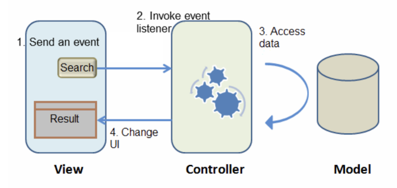

`Desarrollo Mobile` > `Swift Intermedio 2`

## Sesión 08 - Postwork - Patrones de diseño de arquitectura de apps.

### OBJETIVO

- Entregar con el / la mentor(a) la app de ejemplo finalizada, compilando sin problemas y funcionando.
* La funcionalidad esperada será:
   * Presentar un listado de _Contactos_ prellenado.
   * Poder introducir un nuevo _Contacto_.
   * Mostrar una _Alerta_ confirmando que el _Contacto_ ha sido agregado con éxito.
   * Refrescar la _Tabla_ de _Contactos_.

#### REQUISITOS

1. Xcode 12+.
2. La app que has estado utilizando en esta sesión.

#### DESARROLLO

* Analiza la funcionalidad de la app, comenta con tu mentor(a) el patrón de diseño **MVVM**.

* La App final se deberá de ver así:
* 

# ¡FELICIDADES, HAS COMPLETADO CON ÉXITO EL MODULO DE SWIFT INTERMEDIO II!
# ¡NOS VEMOS LA PRÓXIMA!