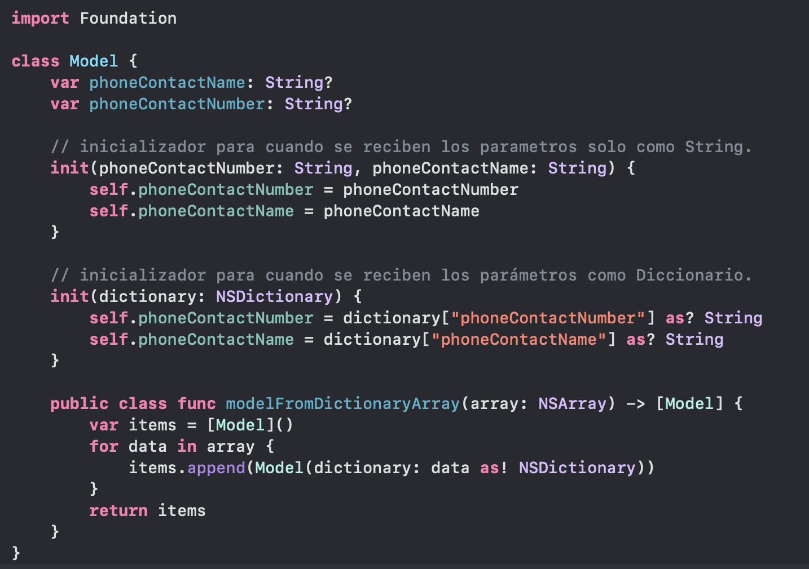

`Desarrollo Mobile` > `Swift Intermedio 2`

	
## MVP con completions

### OBJETIVO 

- Notificar al View mediante Closures creados en el Presenter. 

#### REQUISITOS 

1. Ejemplo-01
2. Xcode 11

#### DESARROLLO

Modificación de la App con patrón MVP agregando Completions para notificar al View.

Modular pequeñas funcionalidades en Clases, e implementar completions simples a manera de closures o pasando las funciones.



<details>
	<summary>Solución</summary>
	<p> Agregar un nuevo elemento a la App, un **TextField**.</p>

```
	@IBOutlet weak var inputText: UITextField!
```

<p> Agregar una nueva función al Presenter, esta función tendra un completion que notificará al View de cambios. </p>

```
  func processInPresenter(input: String, completion: (String) -> Void) {
    // Some example code...
    completion("\(input) Has been procesed!")
  }
```

<p> Finalmente, en el ViewController agregamos la funcionalidad del Input para que conviva con esta nueva función. </p>

```
guard let text = self.inputText.text else { return }
presenter.processInPresenter(input: text) { (result: String) in
	print("Processed value: \(result)")
}
```

</details> 

