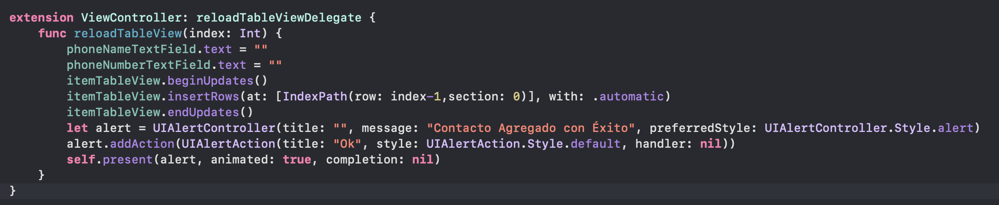

 
`Desarrollo Mobile` > `Swift Intermedio 2`

	
## Galeria de fotos con patron MVP

### OBJETIVO 

- Crear un proyecto que muestre una galeria de fotos utilizando `UICollectionView`.


#### REQUISITOS 

1. Xcode 11

#### DESARROLLO

Crear una app que muestre imagenes descargadas de internet.

Las imagenes mostrarlas en un custom cell.

El Presenter debe hacer el Request de tipo GET o en su defecto leer imágenes almacenadas en el proyecto.

Ir actualizando las celdas, es decir, se implementarán múltiples request.

La lógica del request debe estar en el Presenter.

No usar Delegate para comunicar el Presenter, se pueden usar Completions.



<details>
	<summary>Solucion</summary>
<p> Creamos el ViewController, en donde tendremos la referencia del Presenter.</p>
	
```
@IBOutlet weak var collection: UICollectionView!
var presenter: Presenter?
let idCell = "ImageCollectionViewCell"
```
<p>El Presenter tendra una referencia del ViewController, esto para que una vez terminado el request pueda actualizar el CollectionView.</p>
	
```
presenter = Presenter(view: self)
presenter?.download()
```

<p>La función que debe ejecutar es la siguiente:</p>

```
  func reloadView() {
    DispatchQueue.main.async {
      self.collection.reloadData()
    }
  }
```

<p> Dentro de Cell For Row at indexPath, consultaremos los Images descargados.

```
    cell.imageView.image = presenter?.items[indexPath.row]
```
	
</details> 


